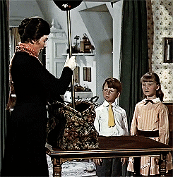

```{r setup, include=FALSE}
rm(list=ls())

options(htmltools.dir.version = FALSE)

knitr::opts_chunk$set(fig.width=4.25, fig.height=3.5, fig.retina=3,
                      message=FALSE, warning=FALSE, cache = TRUE, 
                      autodep = TRUE, hiline=TRUE
                      , dev = "svg"
                      )

options(knitr.kable.NA = '')

```


class: middle clear

#### SPO, STAF e STATIMP

--

<br>
### ***Vademecum***

1. Il percorso *classico*: troviamo e commentiamo dei dati

--
2. Un'*alternativa*, ma esiste qualcosa oltre i dati?

--
3. Confrontare dati diversi, si può? (Oltre alle nostre percezioni?) 


---

# Attualità e la regola delle 3c

## Un esempio dall'attualità mediatica del Canton Ticino

.pull-left[
###### Titolo della serata: **La verità oltre i numeri**
[
](https://www.rsi.ch/play/tv/popupvideoplayer?id=12750903&startTime=60.45)

.font70[
Quando la statistica serve a dare... *sapore*
].font50[.mid-warm-grey[RSI, 60 minuti - 17 febbraio 2020  
(primi 5 minuti)
]]]

--

.pull-right[
#### La regola delle 3C
.font90[
1. **.hl[**C**]onfrontabile** .font80[.mid-warm-grey[*[Check]*]]  
È possibile il confronto tra percezione e dati? E il contrario?

2. **.hl[**C**]omprensibile** .font80[.mid-warm-grey[*[Understand the context]*]]  
Rispetto al contesto ha senso usare dei dati statistici

3. **.hl[**C**]onsapevoli** .font80[.mid-warm-grey[*[Be aware of the source]*]]  
Si sa da dove arriva il dato e perché si usa una determinata fonte  
]
]

---
class: inverse, center, middle

# **SPO | ** la Statistica delle persone occupate <html><div style='float:left'></div><hr color='#0070C0' size=1px></html>

```{r, echo=FALSE, message=FALSE, warning=FALSE, results='hide'}
source(file = "Figure_semiauto.R", encoding = "UTF-8", echo=FALSE)
```

---
class: clear

.font90[
.left-column[
#### Persone occupate, in Svizzera e in Ticino

]
]


.right-column[
```{r p1, echo=FALSE, eval=TRUE, out.width= 750}
p1
```
]

---
class: clear

.font90[
.left-column[
#### Persone occupate, in Svizzera e in Ticino
#### Persone occupate, secondo il genere, in Svizzera

]
]


.right-column[
```{r p3, echo=FALSE, eval=TRUE, out.width= 750}
p3
```
]


---
class: clear

.font90[
.left-column[
#### Persone occupate, in Svizzera e in Ticino
#### Persone occupate, secondo il genere, in Svizzera
#### Persone occupate, secondo il genere, in Ticino

]
]


.right-column[
```{r p2, echo=FALSE, eval=TRUE, out.width= 750}
p2
```
]

---
class: clear

.font90[
.left-column[
#### Persone occupate, in Svizzera e in Ticino
#### Persone occupate, secondo il genere, in Svizzera
#### Persone occupate, secondo il genere, in Ticino
#### Quota delle persone occupate in Ticino, secondo il genere (in %)
]
]


.right-column[
```{r p8, echo=FALSE, eval=TRUE, out.width= 750}
p8
```
]

---
class: middle clear
### SPO: appunti

.mid-warm-grey[
.font80[
Primi confronti
]
]

--

.pull-left[
##### .hl[Applicazione] della cultura dello scoprire
.img-left[]

.font70[
Grazie anche alla *Regola delle 3C*:  
- *Confrontabile*  
- *Comprensibile*  
- *Consapevoli*

]
]


.pull-right[
##### Confronto tendenze oggettive e percezioni
.img.left[]
.font80[
- Quanti e quali i risultati attesi  
- Quanti e quali i risultati *"sorprendenti"*

]
]


---
class: inverse, center, middle

# **STAF | **la statistica dei frontalieri <html><div style='float:left'></div><hr color='#0070C0' size=1px></html>


---
class: clear

.font90[
.left-column[
#### Frontalieri, in Svizzera e in Ticino

]
]

--

.right-column[
```{r f1, echo=FALSE, eval=TRUE, out.width= 750}
f1
```
]

---
class: clear

.font90[
.left-column[
#### Frontalieri, in Svizzera e in Ticino
#### Frontalieri, secondo il genere, in Ticino

]
]


.right-column[
```{r f2, echo=FALSE, eval=TRUE, out.width= 750}
f2
```
]


---
class: clear

.font90[
.left-column[
#### Frontalieri, in Svizzera e in Ticino
#### Frontalieri, secondo il genere, in Ticino
#### Quota di frontalieri donna, in Svizzera e in Ticino (in %)

]
]


.right-column[
```{r f4, echo=FALSE, eval=TRUE, out.width= 750}
f4
```
]

---
class: clear

.font90[
.left-column[
#### Frontalieri, in Svizzera e in Ticino
#### Frontalieri, secondo il genere, in Ticino
#### Quota di frontalieri donna, in Svizzera e in Ticino (in %)
#### Quota di frontalieri occupati in Ticino (in %)
]
]


.right-column[
```{r f8, echo=FALSE, eval=TRUE, out.width= 750}
f8
```
]

---
class: middle clear

### Non solo dati e percezioni

.pull-left[
.mid-warm-grey[
.font80[
I metadati  
--> ma dove sono?

<br>
.img-left[]

]]
]


--

.pull-right[
.font70[
Dalla cultura del ~~pretendere~~
]

Una soluzione pratica   
[perché no... .hl[Google]](https://www.google.com)

Prima la cultura della scoperta per arrivare  
alla cultura del .hl[confronto]

]


---
class: inverse, center, middle

# **STATIMP |** la statistica dell'impiego <html><div style='float:left'></div><hr color='#0070C0' size=1px></html>

---

class: middle clear

### E se provassimo a fare il contrario?

.mid-warm-grey[
.font80[
Partenza: i metadati?
]
]

--
Ma dove sono?

--

[Ufficio federale di statistica](www.bfs.admin.ch)

---
class: clear

.font90[
.left-column[
#### Impieghi, in Svizzera e in Ticino

]
]


.right-column[
```{r i1, echo=FALSE, eval=TRUE, out.width= 750}
i1
```
]

---
class: clear

.font90[
.left-column[
#### Impieghi, in Svizzera e in Ticino
#### Impieghi, secondo il genere, in Ticino

]
]


.right-column[
```{r i3, echo=FALSE, eval=TRUE, out.width= 750}
i3
```
]

---
class: clear

.font90[
.left-column[
#### Impieghi, in Svizzera e in Ticino
#### Impieghi, secondo il genere, in Ticino
#### Quota di impieghi a tempo parziale, tra le donne, in Svizzera e in Ticino

]
]


.right-column[
```{r i9, echo=FALSE, eval=TRUE, out.width= 750}
i9
```
]

---
class: clear

.font90[
.left-column[
#### Impieghi, in Svizzera e in Ticino
#### Impieghi, secondo il genere, in Ticino
#### Quota di impieghi a tempo parziale, tra le donne, in Svizzera e in Ticino
#### Quota di impieghi a tempo parziale, tra gli uomini, in Svizzera e in Ticino

]
]


.right-column[
```{r i10, echo=FALSE, eval=TRUE, out.width= 750}
i10
```
]

---
# Riepilogo

.font80[
.pull-left[
##### Cosa sapevamo della SPO, STAF e STATIMP prima
Cosa sappiamo ora e  
come possiamo .hl[usare **con** consapevolezza]  
questa conoscenza 

]
]

.pull-right[
.img-left[]

]

---
# La regola delle 3C

.font80[
.left-column[
#### **PRIMA:** il mondo della statistica era quasi magico
#### **ORA:** l'intellegìbile cerca il sensibile e...
<br>
.img-left[]
]
]

--

.right-column[
##### La regola delle 3C
##### .mid-warm-grey[CUBe's rule: `*Check, understand, be aware*`]
1. .hl[**C**onfrontabile], dato e percezioni sono confrontabili? E il contrario?  
.mid-warm-grey[*[**C**heck]*]  
2. .hl[**C**omprensibile], l'uso dei dati ha senso rispetto al contesto?  
.mid-warm-grey[*[**U**nderstand  the context]*]  
3. .hl[**C**onsapevoli], sappiamo perché stiamo usando (o vorremmo usare) questa fonte di dati?  
.mid-warm-grey[*[**Be** aware of the source]*]

]

---
# Prossimo incontro

.font80[
.left-column[
#### Dalla cultura del pretendere
#### Alla cultura del confronto
#### Una statistica *famosa*, ma, purtroppo, poco conosciuta... la **RSS**

]
]


.right-column[

  

Di cosa ci stiamo occupando esattamente?  

*"Io sono uno spalatore di neve culturale, produco articoli riempitivi che servono alla nostra società capitalistica avanzata per riempire i vuoti temporali e informativi."* .font60[.mid-warm-grey[*[Dance, dance, dance, Haruki Murakami]*]]


.font70[
<br>
Contatto:      
[eric.stephani@ti.ch](mailto:eric.stephani@ti.ch)  
<br>
.mid-warm-grey[
Slides create con R, via [**{xaringan}**](https://github.com/yihui/xaringan)
]]
]
